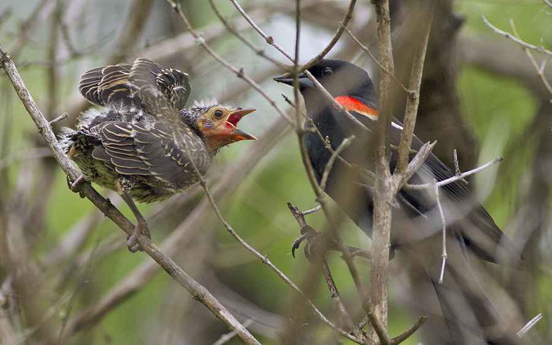
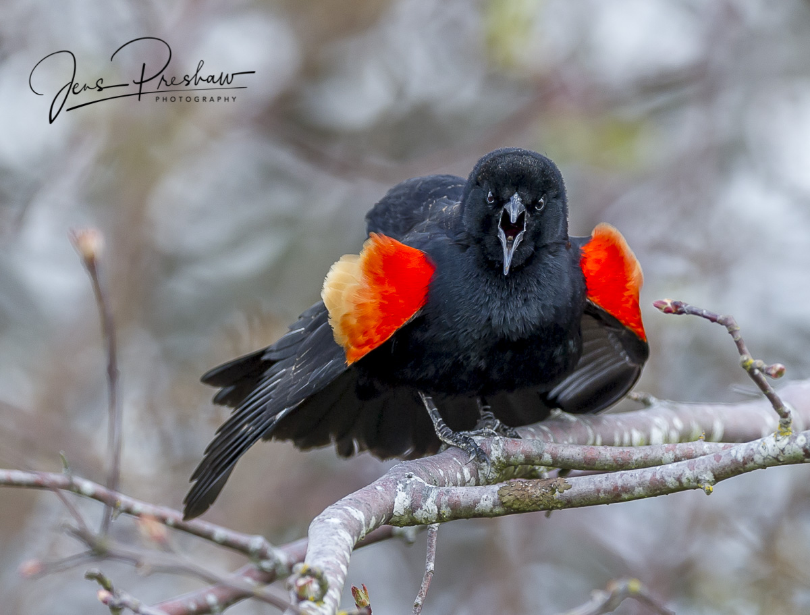

```{r setup, include=FALSE}
knitr::opts_chunk$set(
	echo = FALSE,
	message = FALSE,
	warning = FALSE
)
packages_needed <- c("ggplot2", # graphics
                     "plyr",
                     "arm", # display() etc.
                     "MASS",
                     "dplyr",
                     "ggfortify",
                     "easystats"
                     )
pk_to_install <- packages_needed [!( packages_needed %in% rownames(installed.packages())  )]
if(length(pk_to_install)>0 ){
  install.packages(pk_to_install,repos="http://cran.r-project.org")
}
#lapply(packages_needed, require, character.only = TRUE)
library(ggplot2)
library(plyr)
library(arm)
library(MASS)
library(dplyr)
library(ggfortify)
library(easystats)
```


```{r import nest data, message=FALSE, warning=FALSE}
nest <- read.csv("nestwatch.csv")


nest <- select(nest, ClutchSize, HumanPopulationDensity, Noise)

```


```{r import RWB data, message=FALSE, warning=FALSE}
clutch <- read.csv("clutch.csv")

clutch <- select(clutch, CLUTCH.SIZE, IncDoYr, dist2bldg, dist2water)


```


# Red Wing Black Bird Example


**Included here is data on the clutch sizes and Julian start date of incubation for 1,293 Red Wing Black Birds from marshes of the Hudson River Valley, NY.**







## Data 


**Count Data**


```{r histogram, message=FALSE, warning=FALSE}
ggplot(clutch, aes(x = CLUTCH.SIZE)) +
geom_histogram() +
  xlab("Clutch Size") + ylab("Count") +
  ggtitle("Count Data of RWB Clutch Sizes")
```


## Gaussian vs Poisson Plots


```{r plot clutch, message=FALSE, warning=FALSE, fig.width=4, fig.height=4}
ggplot(clutch, aes(IncDoYr, CLUTCH.SIZE)) +
  geom_point(size=.8) +
  geom_smooth (method=lm, color="red") + #if you wanted to see the gaussian/identity fit
  stat_smooth(method = glm, method.args = list(family = poisson(link = "log"))) +
xlab("Incubation start (Julian Date)") + ylab("Clutch Size") + 
  ggtitle("Clutch Size in relation to DOY")
```


```{r compare poisson vs gaussian plots of clutch, message=FALSE, warning=FALSE}
ggplot(clutch, aes(x = IncDoYr, y = CLUTCH.SIZE)) +
geom_point() +
geom_smooth(method = "glm", method.args=list(family="gaussian"(link="identity")))+
#geom_smooth(span = 1, colour = "red", se = FALSE) +
xlab("Incubation start (Julian Date)") + ylab("Clutch Size") +
  ggtitle("Linear Model = Gaussian Error Structure, Identity Link")
#note negative prediction of fitness below ~3kg.

ggplot(clutch, aes(x = IncDoYr, y = CLUTCH.SIZE)) +
geom_point() +
geom_smooth(method="glm", method.args=list(family="poisson"(link="log"))) +
xlab("Incubation start (Julian Date)") + ylab("Clutch Size") +
  ggtitle("Linear Model = Poisson Error Structure, Log Link")
```


## Model Evaluations


```{r clutch glm model, message=FALSE, warning=FALSE}
c.glm <- glm(CLUTCH.SIZE ~ IncDoYr, data = clutch, family = poisson(link = log))
#this is the same model as above, but all defaults are explicitly reported rather than assumed

summary(c.glm)
```

```{r diagnose clutch glm model, fig.height=6, fig.width=6, message=FALSE, warning=FALSE}
autoplot(c.glm)
```

```{r clutch qglm model, message=FALSE, warning=FALSE}
c.qglm <- glm(CLUTCH.SIZE ~ IncDoYr, data = clutch, family = quasipoisson)
#this is the same model as above, but all defaults are explicitly reported rather than assumed

summary(c.qglm)
```


**Diagnostic Plots look about the same**


```{r diagnose clutch qglm model, fig.height=6, fig.width=6, message=FALSE, warning=FALSE}
autoplot(c.qglm)
```


**Although there is an enormous amount of underdispersion, what would be the clutch size of a RWB in the Hudson River Valley on day 150? Answer = e^(1.89-.00434x150) ~ 3**


```{r calculation, message=FALSE, warning=FALSE}

a <- exp(1.89-.004341*150)

a

```


**'Best' transformation is the log (λ = 1.9)?**


```{r boxcox, message=FALSE, warning=FALSE}

bc <- boxcox(glm(CLUTCH.SIZE~IncDoYr, data = clutch))

bc
```


# Clutch Size vs Population Density Example


**This data looks at clutch sizes and nest success in relation to light and noise pollution levels for 142 bird species.**


## Data 


**Count Data**


```{r histogram2, message=FALSE, warning=FALSE}
ggplot(nest, aes(x = ClutchSize)) +
geom_histogram() +
  xlab("Clutch Size") + ylab("Count") +
  ggtitle("Count Data of Clutch Sizes")
```


## Gaussian vs Poisson Plots


```{r plot clutch2, message=FALSE, warning=FALSE, fig.width=4, fig.height=4}
ggplot(nest, aes(HumanPopulationDensity, ClutchSize)) +
  geom_point(size=.8) +
  geom_smooth (method=lm, color="red") + #if you wanted to see the gaussian/identity fit
  stat_smooth(method = glm, method.args = list(family = poisson(link = "log"))) +
xlab("Pop Density") + ylab("Clutch Size") + 
  ggtitle("Clutch Size vs Human Pop. Dens")
```


## Model Evaluations


```{r clutch glm model2, message=FALSE, warning=FALSE}
n.glm <- glm(ClutchSize ~ HumanPopulationDensity, data = nest, family = poisson(link = log))
#this is the same model as above, but all defaults are explicitly reported rather than assumed

summary(n.glm)
```

```{r diagnose clutch glm model2, fig.height=6, fig.width=6, message=FALSE, warning=FALSE}
autoplot(n.glm)
```


```{r clutch qglm model2, message=FALSE, warning=FALSE}
n.qglm <- glm(ClutchSize ~ HumanPopulationDensity, data = nest, family = quasipoisson)
#this is the same model as above, but all defaults are explicitly reported rather than assumed

summary(n.qglm)
```


**Diagnostic Plots look about the same**


```{r diagnose clutch qglm model2, fig.height=6, fig.width=6, message=FALSE, warning=FALSE}
autoplot(n.qglm)
```


**Best Transformation is (λ = 1)**


```{r boxcox2, message=FALSE, warning=FALSE}

bc2 <- boxcox(glm(ClutchSize~HumanPopulationDensity, data = nest))

bc2
```